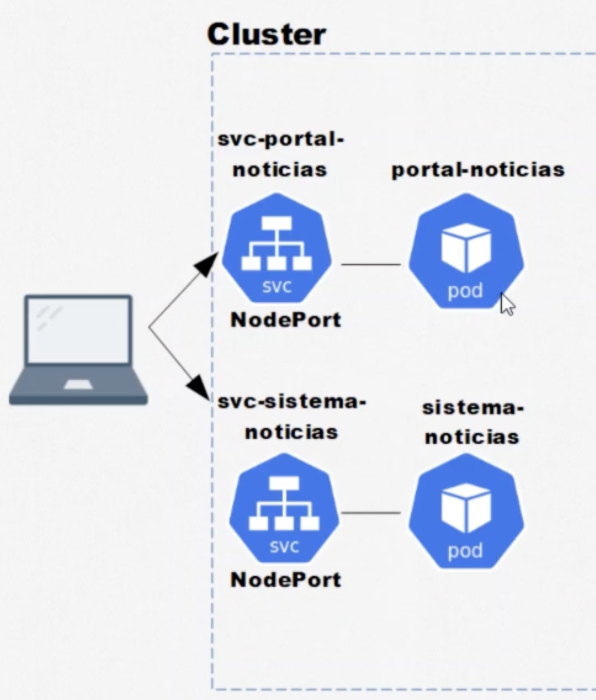

# Kubernetes

O [Kubernetes](https://kubernetes.io/docs/home/) é um mecanismo de orquestração de contêineres de código aberto para automatizar a implantação, o escalonamento e o gerenciamento de aplicativos em contêineres.

Com o Kubernetes podemos gerenciar a escalabilidade, por exemplo.

## Escalabilidade
Escalabilidade vertical ocorre quando se aumenta os recursos de um único nó, uma máquina, como CPU ou memória, para lidar com cargas de trabalho maiores. Isso pode ser feito através da configuração do Kubernetes para alocar mais recursos para os pods ou ajustando as especificações dos nós no cluster.

Escalabilidade horizontal acontece quando se adiciona mais máquinas em paralelo para distribuir a carga de trabalho. No Kubernetes, isso é feito através do Horizontal Pod Autoscaler (HPA), que ajusta automaticamente o número de pods em um deployment com base na utilização de recursos, como CPU ou memória.

## Cluster
Cluster é um conjunto de nós (máquinas) que executam aplicações em contêineres. No Kubernetes, um cluster é composto por um ou mais nós de trabalho (worker nodes) e um nó mestre (master node) que gerencia o estado do cluster. Podem ser feitos com AWS, Azure, Google Cloud Platform.


### Componentes do Cluster
O cluster Kubernetes é composto por dois tipos principais de nós: o **Control Plane** e os **Nodes**.

As máquinas dentro do cluster podem ser `master` que são responsáveis por gerenciar o cluster, manter e atualizar o estado desejado dos recursos, e receber e executar novos comandos. Já o `node` é responsável por executar as aplicações.


`kubectl` é a ferramenta de linha de comando do Kubernetes que permite interagir com a Api do cluster, executar comandos e gerenciar recursos. É uma ferramenta essencial para desenvolvedores e administradores que trabalham com Kubernetes.

## Instalação

No Docker Desktop, em configurações, podemos instalar o Kubernetes. Podemos executar `kubectl version --client`para verificar.


O [minikube](https://minikube.sigs.k8s.io/docs/start/) é uma ferramenta que permite criar um cluster local do Kubernetes. Ele é útil para aprendizagem, desenvolvimento e testes, pois permite que os desenvolvedores experimentem o Kubernetes sem precisar configurar um cluster completo em nuvem.

Podemos configurar [drivers para o minikube](https://minikube.sigs.k8s.io/docs/drivers/), que são as tecnologias para criar e gerenciar o cluster local. 

Na aula o professor utilizou `minikube start --driver=virtualmachine`, eu utilizei `minikube start --driver=docker`. Esse comando Inicializa um cluster Kubernetes local de desenvolvimento com um único nó (um cluster "de mentirinha", mas funcional). Ele vai criar um container Docker que simula uma máquina virtual com o Kubernetes dentro. 
```bash
docker info # garante que o dicker está rodando
minikube start --driver=docker --v=7 # inicia o cluster com o driver docker com logs nivel 7
minikube delete --all --purge # deleta clusters, perfil e cache criados
minikube status # verifica status do cluster
kubectl get nodes
minikube profile list # lista perfis do minikube
```


Outros exemplos de drivers são o Google Cloud Platform, Amazon Web Services, Microsoft Azure, entre outros.
No Google Cloud Platform, podemos criar um cluster Kubernetes através do [Google Kubernetes Engine (GKE)](https://cloud.google.com/kubernetes-engine/docs/quickstart). 


## Pods
Um [pod](https://kubernetes.io/docs/concepts/workloads/pods/) é uma cápsula, que pode conter um ou mais containers, que compartilham o mesmo namespace, rede e armazenamento, podendo manter o endereço IP e se comunicar internamente. Os pods são a menor unidade de implantação no Kubernetes. Assim como o Docker gerencia containers, o Kubernetes gerencia pods.

### Criando um Pod
Para criar um pod de maneira imperativa usamos o comando `kubectl run <nome-do-pod> --image=<imagem> --restart=Never` por exemplo:
 * `kubectkl run nginx --image=nginx:latest` cria um pod chamado `nginx` com a imagem do Nginx.
 * `kubectl get pods` lista os pods criados.
 * `kubectl get pods --watch` mostra os pods em tempo real, atualizando a lista conforme mudanças ocorrem.
 * `kubectl describe pod <nome-do-pod>` exibe detalhes sobre o pod, por exemplo `kubectl describe pod nginx-pod`.

Para atualizar a imagem do nosso pod, de maneira imperativa, podemos abrir o arquivo de configuração com `kubectl edit pod nginx-pod` e alterar a linha `image: nginx:latest` para `image: nginx:1.0` (ocorrerá erro, pois nginx não possui essa versão), porém isso não é recomendado, pois o pod não será atualizado automaticamente.

De maneira declarativa podemos criar um arquivo YAML, por exemplo [primeiro-pod-nginx.yaml](primeiro-pod-nginx.yaml).
Para criar o pod a partir do arquivo YAML, usamos o comando `kubectl apply -f primeiro-pod-nginx.yaml` dentro da pasta onde o arquivo está. Isso cria o pod conforme as especificações do arquivo.


Para verificar o status do pod, usamos `kubectl get pods` e para ver os logs do pod, usamos `kubectl logs primeiro-pod-nginx`. Para acessar o terminal do pod, usamos `kubectl exec -it primeiro-pod-nginx -- /bin/bash`.

### Deletando um Pod
Para deletar um pod, usamos o comando `kubectl delete pod <nome-do-pod>`. Ou podemos deletar o pod a partir do arquivo YAML usado para criá-lo, com o comando `kubectl delete -f primeiro-pod-nginx.yaml` por exemplo.
Para verificar a deleção ou capturar o nome do pod: `kubectl get pods`.

Com o comando `kubectl exec -it portal-noticias -- bash` podemos acessar o terminal do pod `portal-noticias`, executando o comando `bash`.

## Services

Com o comando `kubectl describe pod portal-noticias` podemos ver os detalhes do pod, inclusive o endereço IP. Esse endereço pode ser acessado dos outros containers dentro do cluster, mas não de fora dele, a menos que seja exposto através de um serviço (Service) ou Ingress.


Um [Service](https://kubernetes.io/docs/concepts/services-networking/service/) é um recurso do Kubernetes que fornece um ponto de acesso estável para os pods, mesmo que eles sejam criados ou destruídos dinamicamente. São capazes de prover abstrações pra expor aplicações, proveem IP's fixos para comunicação, proveem um DNS para um mais pods e são capazes de fazer balanceamento de carga.
Os tipos de serviços mais comuns são:

### ClusterIP

ClusterIP: expõe o serviço dentro do cluster, permitindo que os pods se comuniquem entre si.
  

Abaixo criamos um serviço que expõe a porta 9000 e a direciona para a porta 80 do pod com a propriedade metadata.label "app" igual a "segundo-pod".

   ```yaml
   apiVersion: v1
   kind: Service
   metadata:
   name: svc-pod-2
   spec:
   type: ClusterIP
   selector:
      app: segundo-pod
   ports:
      - protocol: TCP
         port: 9000
         targetPort: 80
   ```

> Se a porta de entrada for a mesma da saída basta ocultar a propriedade `targetPort`, então a propriedade `port` será a mesma para `targetPort`.

Para criar o serviço, usamos o comando `kubectl apply -f <filename-service.yaml>` dentro da pasta onde o arquivo está. Já `kubectl get svc` lista os serviços criados.


Usamos `kubectl get pods -o wide` mostra os pods com mais detalhes, incluindo o IP do pod.


Acessando o bash do pod-1 conseguimos executar uma request curl para o cluster-ip do [svc-pod-2](services/svc-pod-2.yaml).:
<details>
   <summary>Exemplo de request curl</summary>
   
</details>

### NodePort
NodePort: permite comunicação com o mundo externo


O aruqivo abaixo configura um serviço NodePort que expõe o pod `primeiro-pod` na porta 30000 ([services/svc-pod-1.yaml](services/svc-pod-1.yaml)):
```yaml
apiVersion: v1
kind: Service
metadata:
  name: svc-pod-1
spec:
  type: NodePort
  selector:
    app: primeiro-pod
  ports:
    - port: 80
      nodePort: 30000
```

Utilizamos o IP do nó para acessar o service através da porta 30000. para visualizar usamos o comando `kubectl get node -o wide`.
No linux é suficiente acessar o Internal_IP exibido, na porta 30000, configurada no service.

No Mac M1 é necessário executar `minikube service svc-pod-1` para acessar o serviço no navegador.


Assim podemos acessar o nginx no navegador em `http://127.0.0.1:54755/`.

### LoadBalancer
Load Balancer é um clusterIp que permite a comunicação entre uma máquina do mundo externo e os nossos pods, e cria uma comunicação com o load balancer do cloud provider utilizado. São um ClusterIp e NodePort ao mesmo tempo, mas com o IP externo do provedor de nuvem.

O arquivo de configuração ([services/svc-pod-1.yaml](services/svc-pod-1.yaml)) cria um serviço LoadBalancer que expõe o pod `primeiro-pod` na porta 80 e pode ser executado na AWS, GCP (Google CLoud Platform) e outros provedores com o comando a ser executado dentro do provedor: `kubectl apply -f <file-loadbalancer.yaml>`

* kubectl delete service svc-pod-1
* kubectl apply -f svc-pod-1-loadbalancer.yaml
* minikube service svc-pod-1-loadbalancer

> No Mac, ao usar o minikube para expor o service é selecionada uma porta aleatória para o serviço, diferente da `nodePort`: `minikube service <service-name> --url` [stackoverflow](https://stackoverflow.com/questions/69438912/kubernetes-nodeport-url-getting-changed-with-minikube-service-service).

### Exemplo: Portal Notícias

Para trabalhar com services vamos criar um portal de notícias. Um serviço para o portal de notícias ([svc-portal-noticias.yaml](svc-portal-noticias.yaml)) e outro serviço para o sistema e acesso aos dados  que serão exibidos no portal ([svc-sistema-noticias.yaml](svc-sistema-noticias.yaml)).




```bash
$ kubectl apply -f sistema-noticias.yaml
$ kubectl apply -f svc-sistema-noticias.yaml
$ minikube service svc-sistema-noticias --url
```
