# Kubernetes

O [Kubernetes](https://kubernetes.io/docs/home/) é um mecanismo de orquestração de contêineres de código aberto para automatizar a implantação, o escalonamento e o gerenciamento de aplicativos em contêineres.

Com o Kubernetes podemos gerenciar a escalabilidade, por exemplo.

# Curso 1: Kubernetes: Pods, Services e ConfigMaps

## Escalabilidade
Escalabilidade vertical ocorre quando se aumenta os recursos de um único nó, uma máquina, como CPU ou memória, para lidar com cargas de trabalho maiores. Isso pode ser feito através da configuração do Kubernetes para alocar mais recursos para os pods ou ajustando as especificações dos nós no cluster.

Escalabilidade horizontal acontece quando se adiciona mais máquinas em paralelo para distribuir a carga de trabalho. No Kubernetes, isso é feito através do Horizontal Pod Autoscaler (HPA), que ajusta automaticamente o número de pods em um deployment com base na utilização de recursos, como CPU ou memória.

## Cluster
Cluster é um conjunto de nós (máquinas) que executam aplicações em contêineres. No Kubernetes, um cluster é composto por um ou mais nós de trabalho (worker nodes) e um nó mestre (master node) que gerencia o estado do cluster. Podem ser feitos com AWS, Azure, Google Cloud Platform.

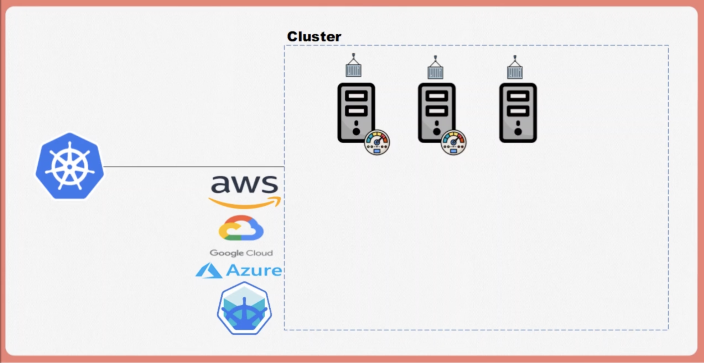

### Componentes do Cluster
O cluster Kubernetes é composto por dois tipos principais de nós: o **Control Plane** e os **Nodes**.

As máquinas dentro do cluster podem ser `master` que são responsáveis por gerenciar o cluster, manter e atualizar o estado desejado dos recursos, e receber e executar novos comandos. Já o `node` é responsável por executar as aplicações.

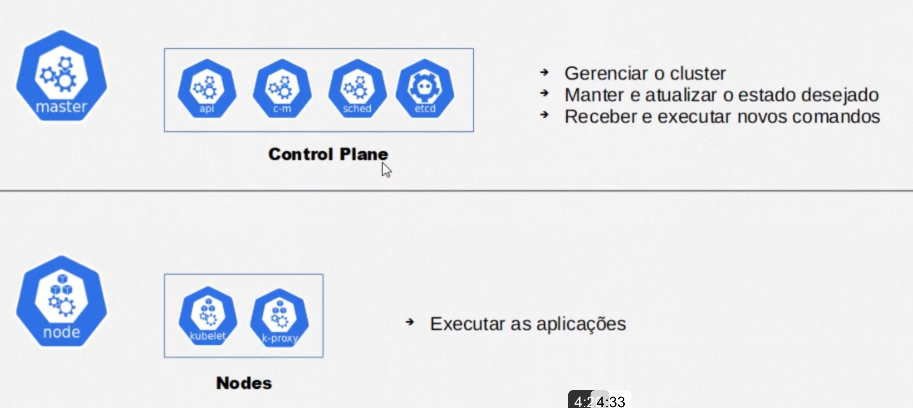

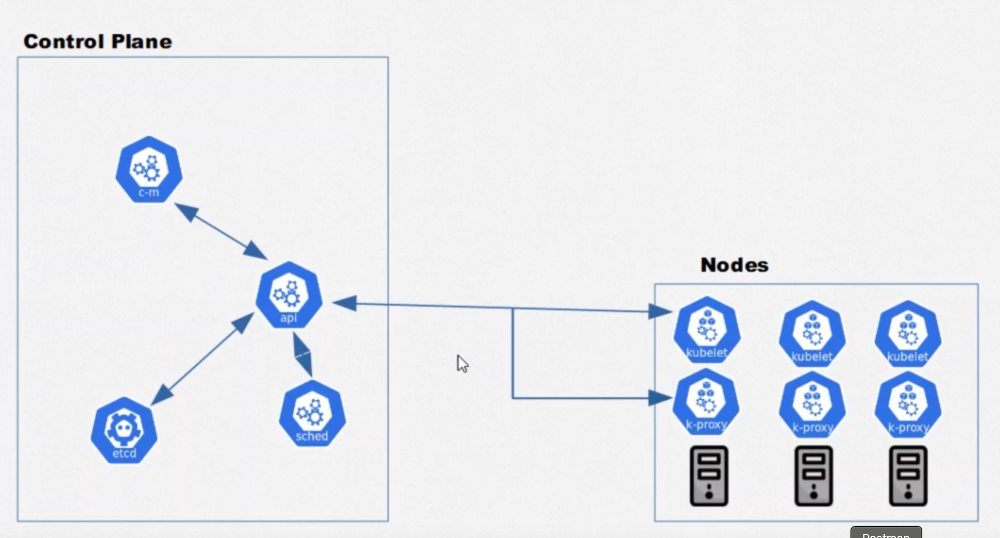

`kubectl` é a ferramenta de linha de comando do Kubernetes que permite interagir com a Api do cluster, executar comandos e gerenciar recursos. É uma ferramenta essencial para desenvolvedores e administradores que trabalham com Kubernetes.

## Instalação

No Docker Desktop, em configurações, podemos instalar o Kubernetes. Podemos executar `kubectl version --client`para verificar.
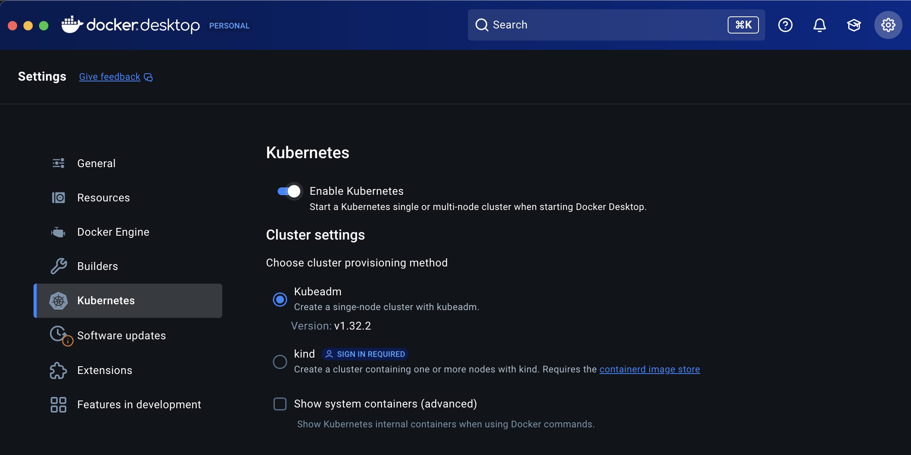

O [minikube](https://minikube.sigs.k8s.io/docs/start/) é uma ferramenta que permite criar um cluster local do Kubernetes. Ele é útil para aprendizagem, desenvolvimento e testes, pois permite que os desenvolvedores experimentem o Kubernetes sem precisar configurar um cluster completo em nuvem.

Podemos configurar [drivers para o minikube](https://minikube.sigs.k8s.io/docs/drivers/), que são as tecnologias para criar e gerenciar o cluster local. 

Na aula o professor utilizou `minikube start --driver=virtualmachine`, eu utilizei `minikube start --driver=docker`. Esse comando Inicializa um cluster Kubernetes local de desenvolvimento com um único nó (um cluster "de mentirinha", mas funcional). Ele vai criar um container Docker que simula uma máquina virtual com o Kubernetes dentro. 
```bash
docker info # garante que o dicker está rodando
minikube start --driver=docker --v=7 # inicia o cluster com o driver docker com logs nivel 7
minikube delete --all --purge # deleta clusters, perfil e cache criados
minikube status # verifica status do cluster
kubectl get nodes
minikube profile list # lista perfis do minikube
```
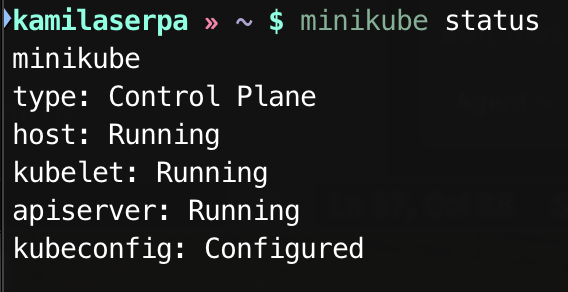

Outros exemplos de drivers são o Google Cloud Platform, Amazon Web Services, Microsoft Azure, entre outros.
No Google Cloud Platform, podemos criar um cluster Kubernetes através do [Google Kubernetes Engine (GKE)](https://cloud.google.com/kubernetes-engine/docs/quickstart). 
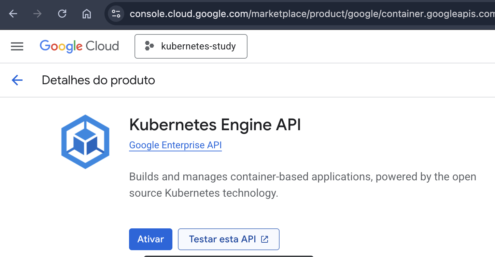

## Pods
Um [pod](https://kubernetes.io/docs/concepts/workloads/pods/) é uma cápsula, que pode conter um ou mais containers, que compartilham o mesmo namespace, rede e armazenamento, podendo manter o endereço IP e se comunicar internamente. Os pods são a menor unidade de implantação no Kubernetes. Assim como o Docker gerencia containers, o Kubernetes gerencia pods.

### Criando um Pod
Para criar um pod de maneira imperativa usamos o comando `kubectl run <nome-do-pod> --image=<imagem> --restart=Never` por exemplo:
 * `kubectkl run nginx --image=nginx:latest` cria um pod chamado `nginx` com a imagem do Nginx.
 * `kubectl get pods` lista os pods criados.
 * `kubectl get pods --watch` mostra os pods em tempo real, atualizando a lista conforme mudanças ocorrem.
 * `kubectl describe pod <nome-do-pod>` exibe detalhes sobre o pod, por exemplo `kubectl describe pod nginx-pod`.

Para atualizar a imagem do nosso pod, de maneira imperativa, podemos abrir o arquivo de configuração com `kubectl edit pod nginx-pod` e alterar a linha `image: nginx:latest` para `image: nginx:1.0` (ocorrerá erro, pois nginx não possui essa versão), porém isso não é recomendado, pois o pod não será atualizado automaticamente.

De maneira declarativa podemos criar um arquivo YAML, por exemplo [primeiro-pod-nginx.yaml](primeiro-pod-nginx.yaml).
Para criar o pod a partir do arquivo YAML, usamos o comando `kubectl apply -f primeiro-pod-nginx.yaml` dentro da pasta onde o arquivo está. Isso cria o pod conforme as especificações do arquivo.
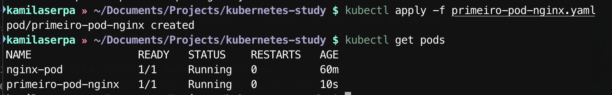

Para verificar o status do pod, usamos `kubectl get pods` e para ver os logs do pod, usamos `kubectl logs primeiro-pod-nginx`. Para acessar o terminal do pod, usamos `kubectl exec -it primeiro-pod-nginx -- /bin/bash`.

### Deletando um Pod
Para deletar um pod, usamos o comando `kubectl delete pod <nome-do-pod>`. Ou podemos deletar o pod a partir do arquivo YAML usado para criá-lo, com o comando `kubectl delete -f primeiro-pod-nginx.yaml` por exemplo.
Para verificar a deleção ou capturar o nome do pod: `kubectl get pods`.

Com o comando `kubectl exec -it portal-noticias -- bash` podemos acessar o terminal do pod `portal-noticias`, executando o comando `bash`.

## Services

Com o comando `kubectl describe pod portal-noticias` podemos ver os detalhes do pod, inclusive o endereço IP. Esse endereço pode ser acessado dos outros containers dentro do cluster, mas não de fora dele, a menos que seja exposto através de um serviço (Service) ou Ingress.

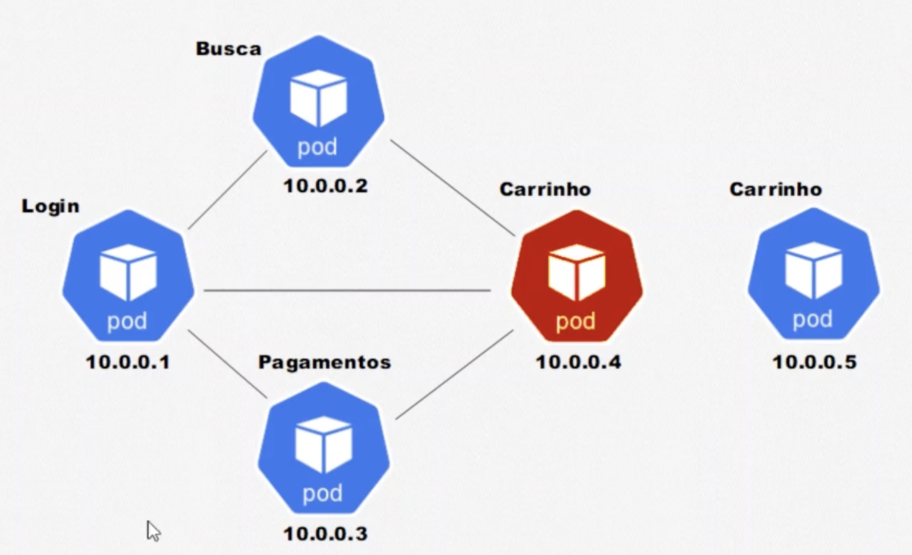

Um [Service](https://kubernetes.io/docs/concepts/services-networking/service/) é um recurso do Kubernetes que fornece um ponto de acesso estável para os pods, mesmo que eles sejam criados ou destruídos dinamicamente. São capazes de prover abstrações pra expor aplicações, proveem IP's fixos para comunicação, proveem um DNS para um mais pods e são capazes de fazer balanceamento de carga.
Os tipos de serviços mais comuns são:

### ClusterIP

ClusterIP: expõe o serviço dentro do cluster, permitindo que os pods se comuniquem entre si.
  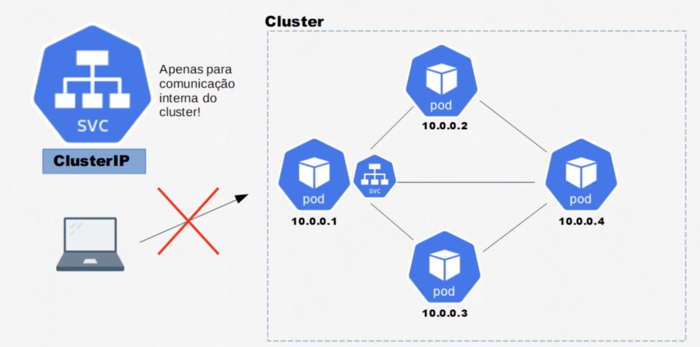

Abaixo criamos um serviço que expõe a porta 9000 e a direciona para a porta 80 do pod com a propriedade metadata.label "app" igual a "segundo-pod".

   ```yaml
   apiVersion: v1
   kind: Service
   metadata:
   name: svc-pod-2
   spec:
   type: ClusterIP
   selector:
      app: segundo-pod
   ports:
      - protocol: TCP
         port: 9000
         targetPort: 80
   ```

> Se a porta de entrada for a mesma da saída basta ocultar a propriedade `targetPort`, então a propriedade `port` será a mesma para `targetPort`.

Para criar o serviço, usamos o comando `kubectl apply -f <filename-service.yaml>` dentro da pasta onde o arquivo está. Já `kubectl get svc` lista os serviços criados.


Usamos `kubectl get pods -o wide` mostra os pods com mais detalhes, incluindo o IP do pod.
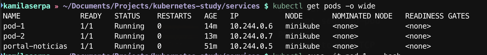

Acessando o bash do pod-1 conseguimos executar uma request curl para o cluster-ip do [svc-pod-2](services/svc-pod-2.yaml).:
<details>
   <summary>Exemplo de request curl</summary>
   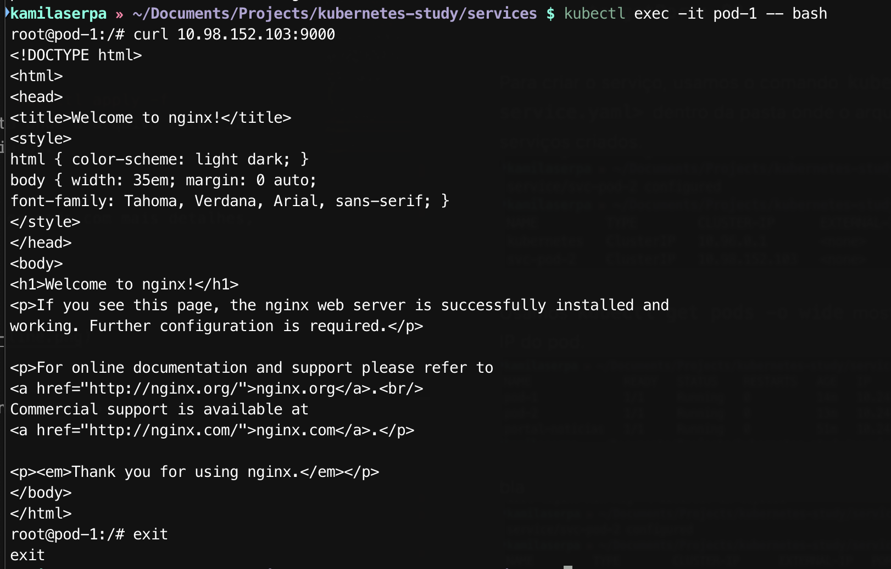
</details>

### NodePort
NodePort: permite comunicação com o mundo externo
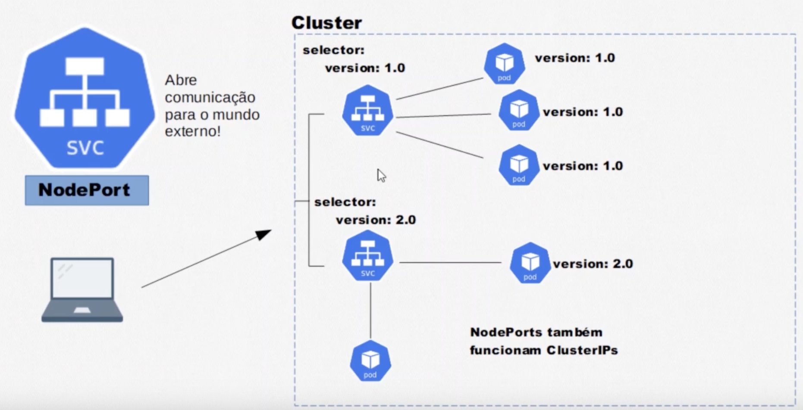

O arquivo abaixo configura um serviço NodePort que expõe o pod `primeiro-pod` na porta 30000 ([services/svc-pod-1.yaml](services/svc-pod-1.yaml)):
```yaml
apiVersion: v1
kind: Service
metadata:
  name: svc-pod-1
spec:
  type: NodePort
  selector:
    app: primeiro-pod
  ports:
    - port: 80
      nodePort: 30000
```


> Poderemos acessar em http://localhost:30000/ a aplicação. Para isso utilizamos o comando `minikube start --driver=docker --ports=30000:30000,30001:30001,30002:30002,30003:30003` que inicia um cluster Kubernetes com minikube, configurando o mapeamento de portas entre o host (sua máquina) e o cluster.
> Porém o mais indicado é executar o comando `$ kubectl port-forward svc/svc-portal-noticias 30000:80` para criar um túnel da porta 80 do service para a 30000 no host. 
> Pois proporciona mais segurança não expondo portas desnecessárias, funciona com qualquer clustere é o padrão da indústria apra acessar clusters remotos.
> Veja mais detalhes em [LoadBalancer](#loadbalancer)/Por que o minikube service mostra uma porta aleatória?

Utilizamos o IP do nó para acessar o service através da porta 30000. para visualizar usamos o comando `kubectl get node -o wide`.
No linux é suficiente acessar o Internal_IP exibido, na porta 30000, configurada no service.

No Mac M1 é necessário executar `minikube service svc-pod-1` para acessar o serviço no navegador.

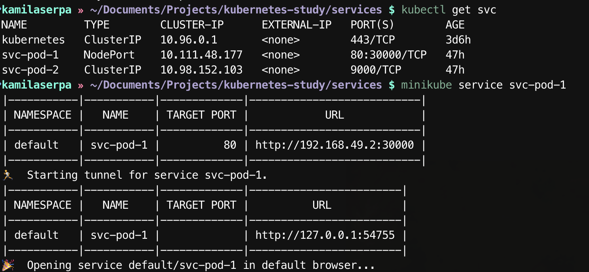

Assim podemos acessar o nginx no navegador em `http://127.0.0.1:54755/`.

### LoadBalancer
Load Balancer é um clusterIp que permite a comunicação entre uma máquina do mundo externo e os nossos pods, e cria uma comunicação com o load balancer do cloud provider utilizado. São um ClusterIp e NodePort ao mesmo tempo, mas com o IP externo do provedor de nuvem.

O arquivo de configuração ([services/svc-pod-1.yaml](services/svc-pod-1.yaml)) cria um serviço LoadBalancer que expõe o pod `primeiro-pod` na porta 80 e pode ser executado na AWS, GCP (Google CLoud Platform) e outros provedores com o comando a ser executado dentro do provedor: `kubectl apply -f <file-loadbalancer.yaml>`

* kubectl delete service svc-pod-1
* kubectl apply -f svc-pod-1-loadbalancer.yaml
* minikube service svc-pod-1-loadbalancer

> No Mac, ao usar o minikube para expor o service é selecionada uma porta aleatória para o serviço, diferente da `nodePort`: `minikube service <service-name> --url` [stackoverflow](https://stackoverflow.com/questions/69438912/kubernetes-nodeport-url-getting-changed-with-minikube-service-service).

**Por que o minikube service mostra uma porta aleatória?**

O comando minikube service cria um túnel temporário entre o host e o nó Kubernetes.

Como esse túnel é feito via kubectl proxy/port-forwarding, ele escolhe uma porta livre no host (no seu caso 50250), ignorando a porta nodePort que está dentro do container do nó.

Para forçar o roteamento podemos executar: `kubectl port-forward svc/<service-name> <node-port>:<svc-port>`.

### Exemplo: Portal Notícias

Para trabalhar com services vamos criar um portal de notícias. Um serviço para o portal de notícias ([svc-portal-noticias.yaml](svc-portal-noticias.yaml)) e outro serviço para o sistema e acesso aos dados  que serão exibidos no portal ([svc-sistema-noticias.yaml](svc-sistema-noticias.yaml)).

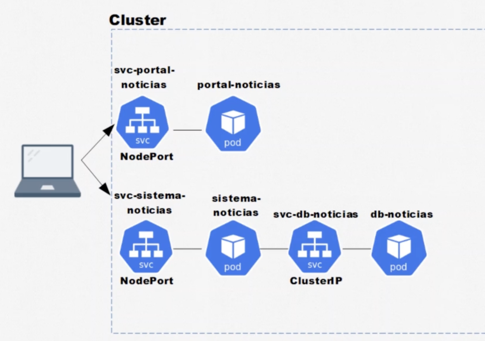

```bash
# Inicia um cluster Kubernetes. Configura o mapeamento de portas entre o host (sua máquina) e o cluster Minikube
$ minikube start --driver=docker --ports=30000:30000,30001:30001,30002:30002,30003:30003
$ kubectl apply -f sistema-noticias.yaml
$ kubectl apply -f svc-sistema-noticias.yaml
# Faz o túnel da porta 80 do service para a 30001 no host
$ kubectl port-forward svc/svc-portal-noticias 30000:80
# Acessa o portal de notícias no navegador em uma porta aleatória, desnecessário se o comando anterior for executado 
# $ minikube service svc-sistema-noticias --url
```

Vamos usar um banco de dados MySQL (https://hub.docker.com/_/mysql) para armazenar as notícias. O serviço do banco de dados ([svc-db-noticias.yaml](svc-db-noticias.yaml)) será do tipo ClusterIP, pois não precisamos acessá-lo diretamente do mundo externo, apenas os pods do sistema de notícias precisam se comunicar com ele.

Podemos visualizar os bancos de dados presentes no pod seguindo os comandos:

```bash
$ kubectl exec -it db-noticias -- bash
$ mysql -u root -p
# q1w2e3r4
$ show databases;
```

Também podemos acessa o arquivo bancodedados.php que contém as configurações de conexão com o banco de dados:

```bash
$ kubectl exec -it sistema-noticias -- bash
cat bancodedados.php
$ kubectl apply -f portal-configmap.yaml
cat configuracao.php
```

### ConfigMap
Para não acoplar informações do recurso com informações de configuração foi utilizado o ConfigMap ([configmap-noticias.yaml](configmap-noticias.yaml)) que contém as variáveis de ambiente necessárias para a conexão com o banco de dados.

O ConfigMap é um recurso do Kubernetes que permite armazenar dados de configuração em pares chave-valor, que podem ser referenciados pelos pods: [db-configmap.yaml](db-configmap.yaml).

Podemos visualizar o ConfigMap com o comando:

```bash
$ kubectl get configmap
$ kubectl describe configmap db-configmap
# $ kubectl get configmap db-configmap -o yaml
```

Podemos referenciar cada variável de um arquivo ConfigMap em um pod utilizando `env`:
```yaml
  env:
  - name: MYSQL_ROOT_PASSWORD
    valueFrom:
      configMapKeyRef:
        name: db-configmap
        key: MYSQL_ROOT_PASSWORD
```

Ou podemos referenciar todo o ConfigMap em um pod, com `envFrom`, como no exemplo:
```yaml
spec:
  containers:
    - ...
      envFrom:
        - configMapRef:
            name: portal-configmap
```

Agora podemos efetuar login no navegador no serviço com admin/admin e visualizar as notícias cadastradas no portal de notícias.

# Curso 2: Kubernetes: Deployments, Volumes e Escalabilidade

## ReplicaSet
Um [ReplicaSet](https://kubernetes.io/docs/concepts/workloads/controllers/replicaset/) é um controlador que garante que um número especificado de réplicas de um pod esteja em execução a qualquer momento. Se um pod falhar ou for excluído, o ReplicaSet cria automaticamente um novo pod para substituí-lo, garantindo alta disponibilidade e resiliência do aplicativo.

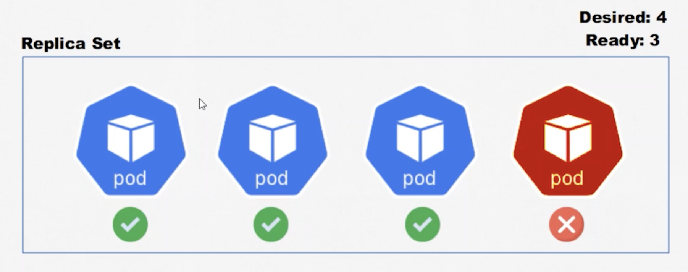

```bash
$ kubectl apply -f portal-noticias-replicaset.yaml
$ kubectl get pods
# Se deletarmos um pod
$ kubectl delete pod portal-noticias
# O ReplicaSet criará automaticamente um novo pod para substituí-lo
$ kubectl get pods
```

## Deployment
Um [Deployment](https://kubernetes.io/docs/concepts/workloads/controllers/deployment/) é um controlador que gerencia a criação e atualização de pods e ReplicaSets. Ele auxiliam no controle de versionamento e criam um ReplicaSet  automaticamente, assim o Kubernetes garante que esse estado seja alcançado e mantido.

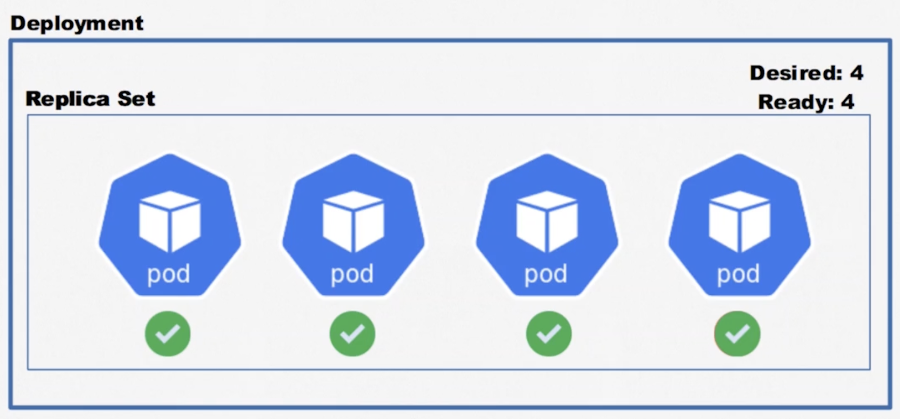

```bash
# A linha abaixo adiciona uma anotação ao deployment nginx-deployment 
$ kubectl annotate deployment nginx-deployment kubernetes.io/change-cause="Atualização do deployment"
# Lista o histórico de rollouts do deployment
$ kubectl rollout history deployment nginx-deployment
```
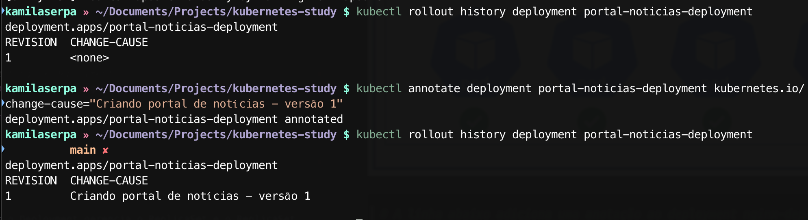

### Deployment x Replicaset

A declaração é igual para ambos neste exemplo, mas o Deployment gerencia o ReplicaSet e o ReplicaSet gerencia os pods. A diferenca foi apenas o kind: Deployment ou ReplicaSet. Dessa forma não é mais necessário criar o ReplicaSet manualmente, arquivos desse kind permanecerão aqui apenas para consulta, porém apenas o Deployment será utilizado.

Criamos e aplicamos os deployments para o portal, service e banco de dados:
```bash
$ kubectl apply -f sistema-noticias-deployment.yaml
$ kubectl apply -f db-noticias-deployment.yaml
$ kubectl annotate deployment db-noticias-deployment kubernetes.io/change-cause="Criando o banco de dados - versão 1"
$ kubectl annotate deployment sistema-noticias-deployment kubernetes.io/change-cause="Executando o sistema - versão 1"
$ kubectl rollout history deployment db-noticias-deployment
```

### Rollback
Para retornar a uma versão anterior de deployment podemos acessar o history e capturar a "REVISION", utilizamos esse dado como a versão que desejamos implantar no comando a

`kubectl rollout undo deployment <nome do deployment> --to-revision=<versão a ser retornada>`

Estrutura do projeto:

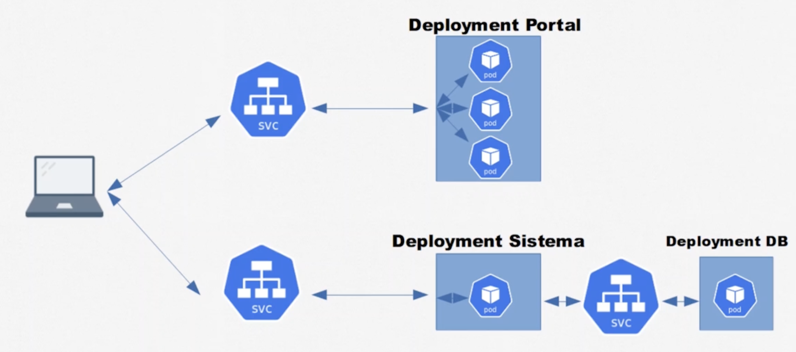

## Volumes: Persistência de dados

Observamos que ao deletarmos os pods e aplicarmos o deployments perdemos os dados que estavam anteriormente no banco, vamos configurar a persistência para que os dados não sejam perdidos.

Os volumes possuem ciclos de vida independentes dos containers. Porém, são dependentes dos pods. Se todos os containers falharesm , o pod vai falhar e o volume será removido.
Porém se um container falhar, o volume continua existindo, pois o pod continua de pé.
A seguir imagem que representa o pod, com dois containers, estando um em falha o volume continua existindo:

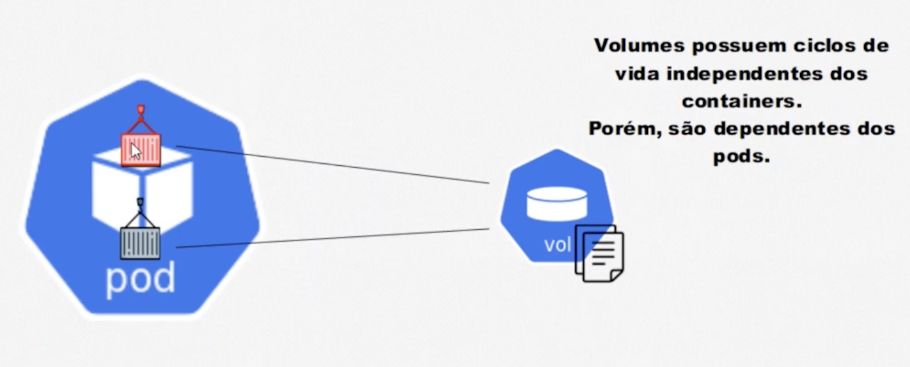

O kubernetes possui vários tipos de volumes, neste curso será utilizado o hostPath, onde o diretório do host é montado dentro dos containers.

```bash
$ kubectl apply -f pod-volume.yaml
$ kubectl exec -it pod-volume --container nginx-container -- bash
$ cd volume-dentro-do-container
$ root@pod-volume:/volume-dentro-do-container# touch arquivo.txt
# irá criar o arquivo e este poderá ser acessado no host
```

No Linux estamos utilizando uma máquina virtual para criar e utilizar o cluster que é o minikube. Logo dentro desse sistema é que devemos criar a pasta de volume.
Vamos criar uma pasta chamada "primeiro-volume" e referencia-lo em [pod-volume-minikube](pod-volume-minikube.yaml):

```bash
$ minikube ssh                                                                   main ✘
docker@minikube:~$ cd /home
docker@minikube:/home$ sudo mkdir primeiro-volume
docker@minikube:/home$
# logout Ctrl+D
```

No yaml podemos configurar para criar automaticamente esse diretório([pod-volume-v2.yaml](pod-volume-v2.yaml)):
```yaml
 hostPath:
        path: /home/primeiro-volume
        type: DirectoryOrCreate
```
EEntão nós podemos acessar a pasta dentro do container "volume-dentro-do-container", criar um arquivo nela. Em seguida podemos ver que esse arquivo também está presente na máquina que hospeda esse container:

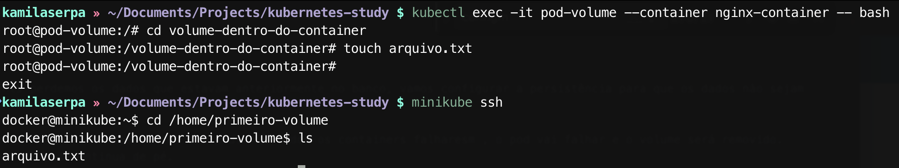

### PersistenceVolume

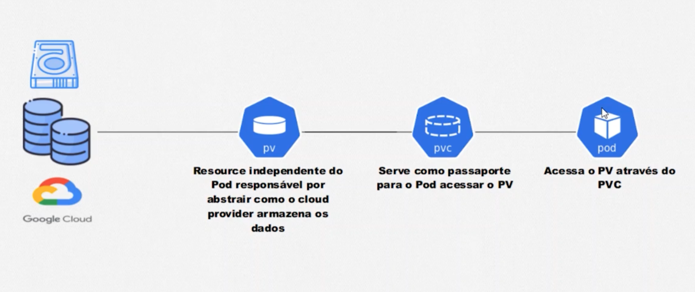

O mecanismo de persistência depende do provisionador de storage. O objeto PersistentVolume (PV) e PersistentVolumeClaim (PVC) são abstrações do Kubernetes.

Quem realmente provê o disco (storage backend) é o StorageClass (ex: GCE Persistent Disk, AWS EBS, Azure Disk, NFS, Ceph, HostPath, etc).

Ou seja, o Kubernetes fala:
“Preciso de um volume com 10Gi que seja persistente”
➡️ Quem vai entregar esse volume depende do ambiente onde o cluster está rodando.

Exemplos:

 - Google Cloud (GKE) → usa GCE PersistentDisk (provisionador kubernetes.io/gce-pd)
 - AWS (EKS) → usa EBS
 - Azure (AKS) → usa AzureDisk/AzureFile

#### O que é um PVC (PersistentVolumeClaim)?

PVC (PersistentVolumeClaim) é um pedido de armazenamento persistente feito pelo desenvolvedor/aplicação.

Ele funciona como uma “ponte” entre a aplicação (que precisa de storage) e o recurso físico de armazenamento (o PV).

Analogia:

 - PV (PersistentVolume) → é como se fosse um HD disponível no datacenter.
 - PVC (PersistentVolumeClaim) → é como se fosse uma requisição de uso de parte desse HD, feita por um aplicativo.
  
  ## Storage Class

  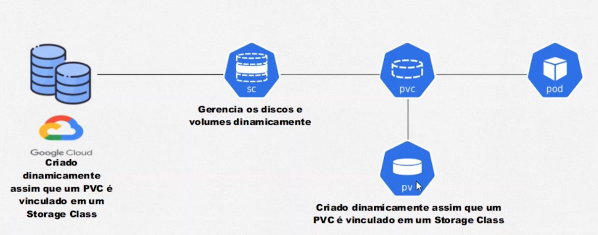
Um [StorageClass](https://kubernetes.io/docs/concepts/storage/storage-classes/) é como uma “receita” para criar volumes dinamicamente no Kubernetes.
Ele diz como e onde o Kubernetes deve provisionar um volume persistente (PV) quando um PVC é criado.

Analogia:

 - PV (PersistentVolume) → é um disco físico já pronto.
 - PVC (PersistentVolumeClaim) → é um pedido de disco feito pela aplicação.
 - StorageClass → é a regra de fábrica que sabe construir discos novos sob demanda.

## Stateful Set

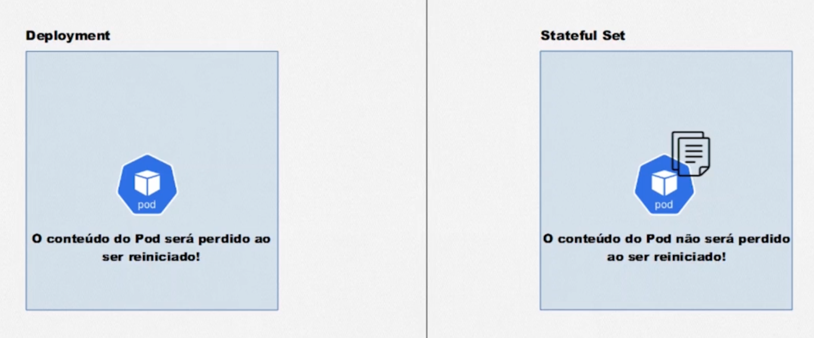

Quando um pod reinicia ou falha, o arquivo é mantido na memória.
Podemos ter diversos pods em cada StatefulSet. StatefulSets usam PersistentVolumes e PersistentVolumeClaims para persistência de dados.

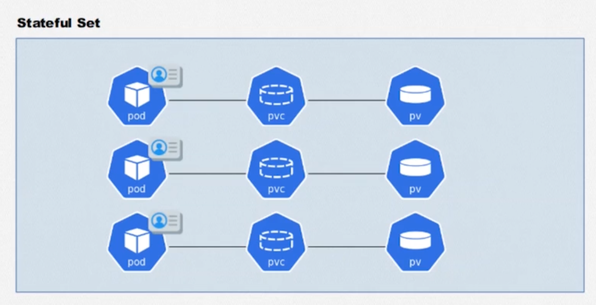

Para verificar a pasta presente dentro sistema-noticias-container:
`kubectl exec -it sistema-noticias-statefulset-0 -- bash`

Ao deletarmos o statefulset com `kubectl delete pod sistema-noticias-statefulset-0` ele cria novamente o pod e mantém os dados dos pods anteriores.

Para funcionar o PVC devemos ter um PersistentVolumeClaim chamado imagens-pvc criado.
```yaml
      volumes:
        - name: imagens
          persistentVolumeClaim:
            claimName: imagens-pvc
```

## Probes

### Liveness Probes

 O kubelet determina se a nossa aplicação deve ser reiniciada ou não. Pois é possível que o pod esteja saudável, mas a aplicação inserida no container não esteja. Com o probes é possível tornar visível ao Kubernetes que uma aplicação não está se comportando da maneira esperada.

 Qualquer código igual ou maior que 200 e menor que 400 significa sucesso, além disso ele considera falha.

 ```yaml
  livenessProbe:
            httpGet:
              path: /
              port: 80
            periodSeconds: 10
            failureThreshold: 3 # número máximo de falhas antes de executar o reinício do container
            initialDelaySeconds: 20 # tempo após o apply para iniciar os testes
 ```

 ### Readlines

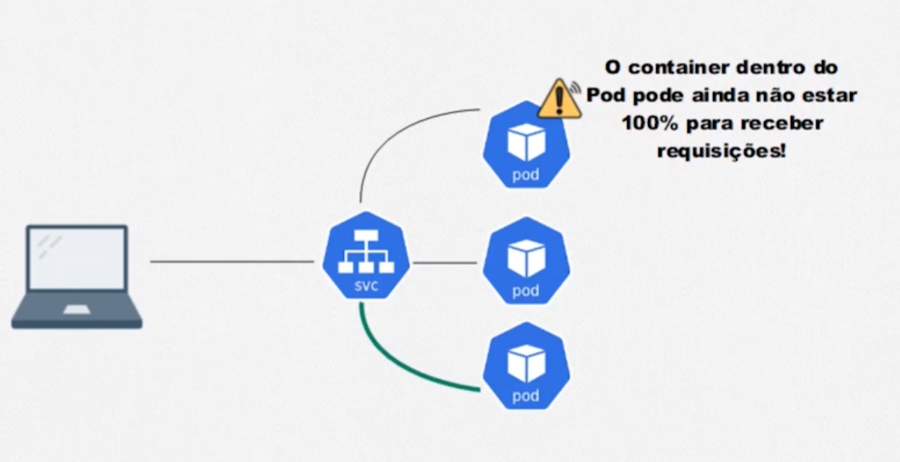

 O readinessProbe é um mecanismo do Kubernetes que determina se um container está pronto para receber tráfego. Diferente do livenessProbe (que verifica se o container está vivo), o readiness probe verifica se o container está funcionalmente pronto para atender requisições.

 Como funciona:
1. Verificação periódica: O Kubernetes executa o probe em intervalos regulares
2. Remoção do Service: Se o probe falha, o pod é removido do Service (não recebe mais tráfego)
3. Reintegração: Quando o probe volta a passar, o pod é reintegrado ao Service

O failureThreshold define quantas falhas consecutivas são permitidas antes que o Kubernetes considere o probe como "falhou definitivamente".
