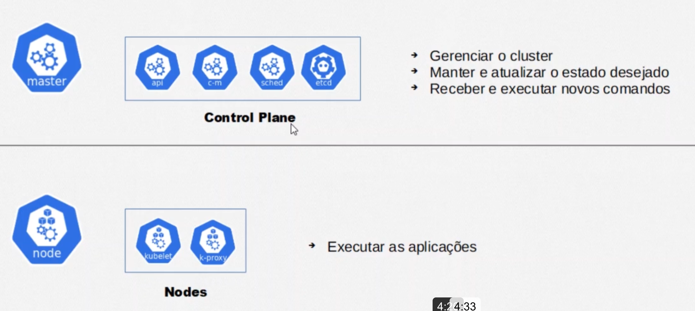
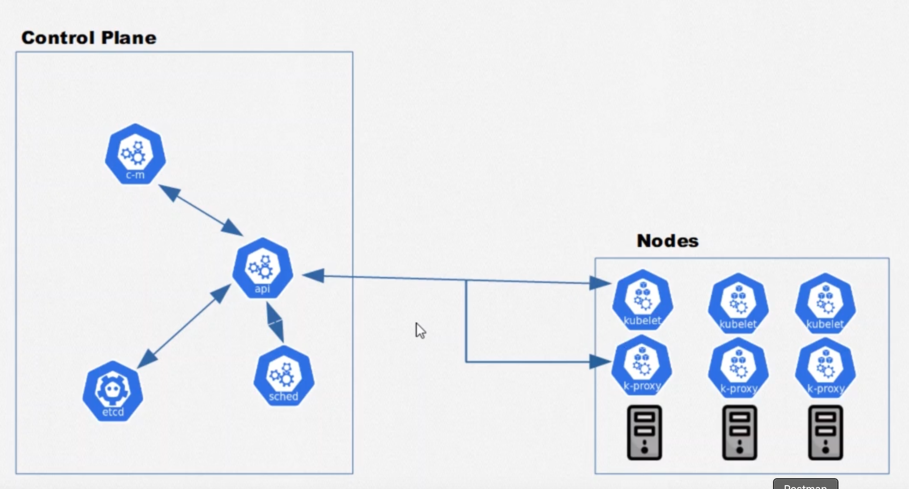
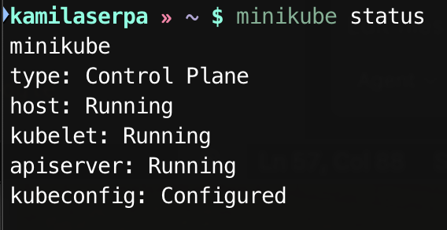

# Kubernetes

O [Kubernetes](https://kubernetes.io/docs/home/) é um mecanismo de orquestração de contêineres de código aberto para automatizar a implantação, o escalonamento e o gerenciamento de aplicativos em contêineres.

Com o Kubernetes podemos gerenciar a escalabilidade, por exemplo.

## Escalabilidade
Escalabilidade vertical ocorre quando se aumenta os recursos de um único nó, uma máquina, como CPU ou memória, para lidar com cargas de trabalho maiores. Isso pode ser feito através da configuração do Kubernetes para alocar mais recursos para os pods ou ajustando as especificações dos nós no cluster.

Escalabilidade horizontal acontece quando se adiciona mais máquinas em paralelo para distribuir a carga de trabalho. No Kubernetes, isso é feito através do Horizontal Pod Autoscaler (HPA), que ajusta automaticamente o número de pods em um deployment com base na utilização de recursos, como CPU ou memória.

## Cluster
Cluster é um conjunto de nós (máquinas) que executam aplicações em contêineres. No Kubernetes, um cluster é composto por um ou mais nós de trabalho (worker nodes) e um nó mestre (master node) que gerencia o estado do cluster. Podem ser feitos com AWS, Azure, Google Cloud Platform.


### Componentes do Cluster
O cluster Kubernetes é composto por dois tipos principais de nós: o **Control Plane** e os **Nodes**.

As máquinas dentro do cluster podem ser `master` que são responsáveis por gerenciar o cluster, manter e atualizar o estado desejado dos recursos, e receber e executar novos comandos. Já o `node` é responsável por executar as aplicações.





`kubectl` é a ferramenta de linha de comando do Kubernetes que permite interagir com a Api do cluster, executar comandos e gerenciar recursos. É uma ferramenta essencial para desenvolvedores e administradores que trabalham com Kubernetes.

## Instalação

No Docker Desktop, em configurações, podemos instalar o Kubernetes. Podemos executar `kubectl version --client`para verificar.


O [minikube](https://minikube.sigs.k8s.io/docs/start/) é uma ferramenta que permite criar um cluster local do Kubernetes. Ele é útil para aprendizagem, desenvolvimento e testes, pois permite que os desenvolvedores experimentem o Kubernetes sem precisar configurar um cluster completo em nuvem.

Podemos configurar [drivers para o minikube](https://minikube.sigs.k8s.io/docs/drivers/), que são as tecnologias para criar e gerenciar o cluster local. 

Na aula o professor utilizou `minikube start --driver=virtualmachine`, eu utilizei `minikube start --driver=docker`. Esse comando Inicializa um cluster Kubernetes local de desenvolvimento com um único nó (um cluster "de mentirinha", mas funcional). Ele vai criar um container Docker que simula uma máquina virtual com o Kubernetes dentro. 
```bash
docker info # garante que o dicker está rodando
minikube start --driver=docker --v=7 # inicia o cluster com o driver docker com logs nivel 7
minikube delete --all --purge # deleta clusters, perfil e cache criados
minikube status # verifica status do cluster
kubectl get nodes
minikube profile list # lista perfis do minikube
```


Outros exemplos de drivers são o Google Cloud Platform, Amazon Web Services, Microsoft Azure, entre outros.
No Google Cloud Platform, podemos criar um cluster Kubernetes através do [Google Kubernetes Engine (GKE)](https://cloud.google.com/kubernetes-engine/docs/quickstart). 


## Pods
Um [pod](https://kubernetes.io/docs/concepts/workloads/pods/) é uma cápsula, que pode conter um ou mais containers, que compartilham o mesmo namespace, rede e armazenamento, podendo manter o endereço IP e se comunicar internamente. Os pods são a menor unidade de implantação no Kubernetes. Assim como o Docker gerencia containers, o Kubernetes gerencia pods.

### Criando um Pod
Para criar um pod de maneira imperativa usamos o comando `kubectl run <nome-do-pod> --image=<imagem> --restart=Never` por exemplo:
 * `kubectkl run nginx --image=nginx:latest` cria um pod chamado `nginx` com a imagem do Nginx.
 * `kubectl get pods` lista os pods criados.
 * `kubectl get pods --watch` mostra os pods em tempo real, atualizando a lista conforme mudanças ocorrem.
 * `kubectl describe pod <nome-do-pod>` exibe detalhes sobre o pod, por exemplo `kubectl describe pod nginx-pod`.

Para atualizar a imagem do nosso pod, de maneira imperativa, podemos abrir o arquivo de configuração com `kubectl edit pod nginx-pod` e alterar a linha `image: nginx:latest` para `image: nginx:1.0` (ocorrerá erro, pois nginx não possui essa versão), porém isso não é recomendado, pois o pod não será atualizado automaticamente.

De maneira declarativa podemos criar um arquivo YAML, por exemplo [primeiro-pod-nginx.yaml](primeiro-pod-nginx.yaml).
Para criar o pod a partir do arquivo YAML, usamos o comando `kubectl apply -f primeiro-pod-nginx.yaml` dentro da pasta onde o arquivo está. Isso cria o pod conforme as especificações do arquivo.


Para verificar o status do pod, usamos `kubectl get pods` e para ver os logs do pod, usamos `kubectl logs primeiro-pod-nginx`. Para acessar o terminal do pod, usamos `kubectl exec -it primeiro-pod-nginx -- /bin/bash`.

### Deletando um Pod
Para deletar um pod, usamos o comando `kubectl delete pod <nome-do-pod>`. Ou podemos deletar o pod a partir do arquivo YAML usado para criá-lo, com o comando `kubectl delete -f primeiro-pod-nginx.yaml` por exemplo.
Para verificar a deleção ou capturar o nome do pod: `kubectl get pods`.

Com o comando `kubectl exec -it portal-noticias -- bash` podemos acessar o terminal do pod `portal-noticias`, executando o comando `bash`.
